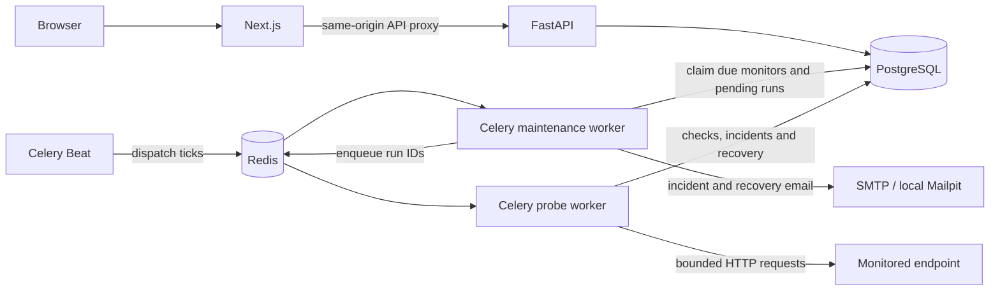

# DevPulse

**Reliability at a glance.**

DevPulse is a full-stack API monitoring platform built to explore background jobs, reliability engineering, incident detection, and observability. It runs locally with Docker and has been validated through automated tests and controlled load testing.

[Run locally](#run-locally) · [Reproduce the showcase](docs/showcase.md) · [Architecture and guides](docs/index.md) · [Validation evidence](docs/portfolio-release.md)

## Preview


Actual application captures from the complete local Docker stack. Celery Beat and workers produced every displayed observation, retry, incident and recovery. These are deliberately controlled demo endpoints, not production traffic. The short observation period occupies a single hourly chart bucket; empty history stays empty.


| Monitor latency history | Incident and recovery |
| --- | --- |
|  |  |
| Response assertion configuration | Actual monitor states |
|  |  |

[Full gallery, assertion failure evidence and capture provenance](docs/release-screenshots.md). Target URLs are masked in captures; measurements and evidence are unchanged.

## What it does

- Schedules HTTP API health checks and tracks response times and observed uptime.
- Evaluates expected status codes, text assertions and typed JSON assertions.
- Retries failures, confirms incidents after three failed attempts, and records recovery automatically.
- Sends opt-in incident and recovery email notifications.
- Provides historical analytics, individual check evidence and retained incident history.

## Architecture



PostgreSQL owns monitoring configuration, durable runs, fenced leases and history. Redis transports jobs. The browser reads stored observations; probes execute in workers.

## Tech stack

| Area | Technologies |
| --- | --- |
| Frontend | Next.js, React, TypeScript, Tailwind CSS, TanStack Query, Recharts, Radix Dialog |
| Backend | Python 3.13, FastAPI, Pydantic, SQLAlchemy, Alembic, HTTPX |
| Data | PostgreSQL 18, Redis |
| Background jobs | Celery prefork workers, Celery Beat |
| Testing | Pytest, Vitest, React Testing Library, Playwright, Mailpit |
| Infrastructure | Docker Compose, digest-pinned runtime images, hashed Python locks, npm lockfile, GitHub Actions configuration |

## Engineering highlights

- **Durable background execution:** Beat scheduling, Redis transport, bounded asynchronous HTTP checks, fenced leases and duplicate-safe database effects.
- **Failure lifecycle:** durable retry state, three-attempt confirmation, automatic recovery and independently retried email delivery.
- **Useful evidence:** immutable assertion snapshots, retained incident evidence, and history that distinguishes missing observations from downtime.
- **SSRF protection:** every DNS answer validated, numeric connection pinning, TLS hostname verification, disabled redirects/proxies, and bounded response sizes and deadlines.

## Verified results

The final release validation recorded **317 backend tests**, **107 frontend component tests**, **12 browser workflows**, **20 operational safeguards**, and **all 10 container stack checks** passing. Two additional container browser tests and default Compose startup/restart also passed.

The final four runtime images had **zero reported vulnerability advisories at every severity** in the October 5, 2026 Trivy scans, without suppression. The controlled local benchmark completed **10,000 successful HTTP probes across 100 simulated monitors**, at **18.826 probes/second** and **49.364 ms dashboard API p95**.

[Exact images, dates, test scope and security evidence](docs/container-release.md). Native browser workflows were verified October 4; container/static validation and the benchmark were refreshed October 5. These results do not claim a hosted CI run or production usage.

## Demo scenario

Five controlled endpoints demonstrate a healthy catalog, a slower search response, a billing outage, a JSON assertion failure, and checkout failure followed by recovery. The full Next.js/FastAPI/PostgreSQL/Redis/Celery/Beat stack produces the UI data. Configuration and next-due times are set by test-only tools; check rows, retry clocks, incidents and observation timestamps are never fabricated.

With the images built and the [showcase prerequisites](docs/showcase.md#reproduce) installed:

```bash
.venv/bin/python scripts/showcase.py
```

The command creates an isolated stack, captures the real UI into `.cache/showcase-output/`, verifies results, and removes its disposable containers and volumes. [Scenario, commands, inspection mode and evidence](docs/showcase.md).

## Run locally

1. Clone this repository using its GitHub **Code** menu, or download and extract its ZIP. Open a terminal in the project directory.
2. Copy the optional frontend environment example and generate Compose's private database environment:

   ```bash
   cp .env.example frontend/.env.local
   python3 scripts/local_stack.py init
   ```

   The example disables Next.js CLI telemetry for native tooling. Compose uses `.cache/compose.env`; the initializer generates its random database password and preserves an existing file. Application services need no native Python or Node installation to run in Docker.

3. Start the complete stack (Docker Engine/Compose and Python 3 are prerequisites):

   ```bash
   BUILDX_GIT_INFO=false docker compose --env-file .cache/compose.env up --build -d --wait
   ```

   Migrations run automatically before the API and workers start. **The first cold build can take several hours** because Node is compiled against patched system OpenSSL; subsequent unchanged builds reuse the compiled stage. Existing Debian PostgreSQL volumes require [logical backup/restore into a new Alpine cluster](docs/containers.md), not direct reuse.

4. Open [DevPulse](http://localhost:3000) and [Mailpit](http://localhost:8025). Register, obtain the verification code from Mailpit, verify your account, and add an authorized public HTTP/S endpoint. Enable incident email under **Notifications**.

Stop while preserving your data:

```bash
docker compose --env-file .cache/compose.env down
```

Only the application and Mailpit bind host ports, on loopback. [Container operations](docs/containers.md) · [Native development](docs/development.md) · [Configuration](docs/api.md#configuration).

## Testing

After [development setup](docs/development.md), export the dedicated test PostgreSQL/Redis settings and start Mailpit for the integration suite:

```bash
# Backend: unit, PostgreSQL, Redis/prefork workers and real SMTP
(cd backend && ../.venv/bin/python -m pytest --run-integration --run-worker --run-mailpit)
# Operational safeguards
.venv/bin/python -m pytest scripts/tests
# Frontend components
(cd frontend && npm test)
# Browser workflows (see the fixture-specific commands in the browser guide)
(cd frontend && npm run test:e2e)
# Static checks and generated API contract
.venv/bin/ruff check backend
.venv/bin/ruff format --check backend
(cd backend && ../.venv/bin/mypy app)
.venv/bin/ruff check --config backend/pyproject.toml scripts containers/fixtures containers/showcase
(cd frontend && npm run check && npm run api:check)
```

[Browser prerequisites and fixture suites](docs/account-ui.md#browser-tests) · [Container tests and full stack smoke](docs/containers.md#controlled-fixtures-and-validation).

## Security

Accounts use Argon2id password hashes, verified email, opaque database-backed sessions, CSRF tokens and exact Origin checks. API queries enforce resource ownership. URL validation and destination checks reject unsafe schemes and private, loopback, reserved and metadata addresses; narrowly scoped fixture exceptions exist only for local tests and are rejected in production mode.

Secrets are supplied through ignored environment files. Runtime images are pinned and were scanned after rebuilding. The clean runtime scan is dated evidence, not a guarantee against future vulnerabilities; one disclosed development-only `braces` advisory remains outside those images. [Security scope and limitations](docs/portfolio-release.md#security-and-public-file-review).

## Performance

**Controlled local benchmark — October 5, 2026**, using the final validated runtime images:

| Measurement | Result |
| --- | ---: |
| Simulated monitors | 100 |
| HTTP probes | 10,000 |
| Successful / failed | 10,000 / 0 |
| Throughput | 18.826 probes/sec |
| Dashboard API p95 latency | 49.364 ms |

The workload used accelerated scheduling and a small controlled HTTP response. It measures this local workload, not production customers, internet latency or maximum capacity. [Method, hardware, sampling and raw evidence](docs/performance.md).

## Known limitations

Monitoring originates from one location, notifications are email-only, and raw check history is retained for 30 days. Infrastructure is portfolio-scale. Observed uptime is a run-weighted ratio, not an SLA; duplicate external HTTP requests or email remain possible after ambiguous failures.

## Project status

**Feature-complete portfolio project. Designed for local Docker execution rather than permanent hosted operation.**
