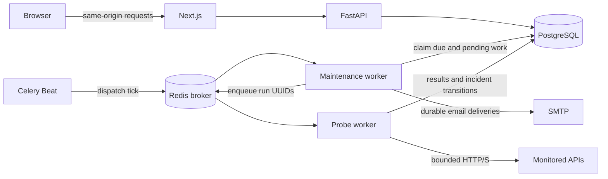

# DevPulse

**Reliability at a glance.**

DevPulse monitors HTTP APIs on a schedule, records response times and assertion results, and follows failures through retries, incidents and recovery. A private workspace provides historical analytics and opt-in incident email; a read-only demo exposes only explicitly published monitoring summaries.

[Product screenshots](docs/release-screenshots.md) · [Local setup](#running-locally) · [Documentation](docs/index.md) · [Release status](docs/portfolio-release.md)

**Deployment:** runs locally; no public application or live-demo URL is available. The [release report](docs/portfolio-release.md) records the remaining security and deployment gates.

## Product preview


Actual browser capture from a disposable test account and real local HTTP probes, including deliberately induced failures. The displayed observations are test evidence, not production traffic or customer uptime. [View mobile, monitor history and notification captures](docs/release-screenshots.md).

## What it does

- Schedule GET/HEAD checks with expected status, text and typed JSON assertions.
- Track observed uptime and response latency across 24-hour, 7-day and 30-day windows.
- Retry failures, confirm incidents after three failed attempts and record recovery on success.
- Inspect individual attempts, retained incident evidence and notification delivery status.
- Publish selected read-only summaries while keeping account data, target URLs and response evidence private.

## Tech stack

| Area | Technologies |
| --- | --- |
| Frontend | Next.js App Router, React, strict TypeScript, Tailwind CSS, TanStack Query, Recharts, Radix Dialog |
| Backend | Python 3.13, FastAPI, Pydantic, SQLAlchemy, Alembic, HTTPX, dnspython |
| Data and jobs | PostgreSQL 18, Redis, Celery prefork workers and Beat |
| Testing | Pytest, Vitest, React Testing Library, Playwright Chromium, Mailpit |
| Delivery tooling | Docker Compose, digest-pinned images, hashed Python locks, npm lockfile, GitHub Actions configuration |

## Architecture



PostgreSQL owns configuration, runs, fenced leases, incidents and delivery state. Redis carries task messages; it is not the history store. The browser polls stored results and never runs probes.

## Monitoring flow

1. Beat triggers a bounded dispatcher; due monitors become durable pending runs.
2. The dispatcher publishes run IDs through Redis after the database transaction commits.
3. A Celery worker claims a fenced lease, validates the destination and performs the HTTP request.
4. Status and configured assertions are evaluated within response-size and time limits.
5. The worker persists the attempt and advances retry, incident or recovery state atomically.
6. Dashboard/history reads reflect stored results; the notification worker processes durable email intent.

## Reliability and security

Late acknowledgments, duplicate-safe database effects and expiring fenced leases support recovery after worker loss. The dispatcher reconciles unpublished and expired work; missed intervals are not fabricated. Notification retries are independent of probing. Raw checks expire after 30 days while incidents retain compact evidence.

Accounts use Argon2id password hashes, opaque database-backed sessions, email verification, CSRF tokens and exact Origin checks. API queries enforce ownership. Production mode requires secure cookies and HTTPS configuration. Secrets belong in ignored local configuration, not images or source.

The probe executor rejects unsafe protocols and private, loopback, reserved and metadata destinations; validates every DNS answer; pins the connection to a validated address; and preserves TLS hostname verification. Redirects and environment proxies are disabled. [Security details and current limitations](docs/portfolio-release.md#security-and-public-file-review).

## Testing

Verified release checks: native browser coverage on **2026-10-04**, refreshed container and static checks on **2026-10-05**:

- **317 backend tests**, zero failures/skips, inside the final Alpine container: PostgreSQL, real Redis/Celery workers, scheduler recovery and SMTP.
- **107 frontend tests** and **20 operational safeguard tests**.
- **12 native Chromium tests** (October 4) and **2 container browser tests** (October 5).
- **10 stack checks** plus a fresh default Compose startup/restart: migrations, health, actual jobs, outages, persistence and backup/restore.
- Ruff lint/format, mypy, ESLint, TypeScript, API contract, actionlint and the container production build passed.
- Four freshly rebuilt runtime images: **zero Trivy findings at every severity** in the October 5 scan; no advisory suppression.

[Container builds, advisory inventory and validation evidence](docs/container-release.md). The Actions workflow has been checked locally, not claimed as a successful hosted run.

## Performance

The **2026-10-05 controlled local benchmark** completed **10,000 real HTTP probes across 100 simulated monitor configurations**, with **10,000 successful and zero failed probes**, two probe-worker processes and **18.826 completed probes/second**. Dashboard API p95 was **49.364 ms** under the documented sampling workload. Workload duration was **531.17 seconds**.

These are accelerated local fixture measurements using the final scanned images, not production usage, customer counts, internet latency or a capacity guarantee. [Method, hardware, queue/database evidence and reproduction](docs/performance.md).

## Running locally

The primary path uses Docker Engine with Compose v2-compatible commands and Python 3 for the initializer. On Windows, use Ubuntu WSL2 with Docker integration enabled. Node/Python application runtimes, PostgreSQL, Redis and Mailpit run in containers.

For an existing Debian-based PostgreSQL stack, read the [logical backup/restore migration warning](docs/containers.md) before starting these Alpine images. Use a new database volume.

The first build compiles Node against patched OpenSSL and can take several hours; unchanged rebuilds reuse the compiled stage. [Measured build details](docs/container-release.md).

From the project directory:

```bash
python3 scripts/local_stack.py init
BUILDX_GIT_INFO=false docker compose --env-file .cache/compose.env config --quiet
BUILDX_GIT_INFO=false docker compose --env-file .cache/compose.env up --build -d --wait
```

Open [the local application](http://localhost:3000) and [Mailpit](http://localhost:8025). Register, retrieve the verification code from Mailpit, verify your account, then create a monitor for a public HTTP/S endpoint you are authorized to check. Enable incident email in **Notifications** if desired. The demo is empty until an operator explicitly publishes a monitor.

Compose starts PostgreSQL, Redis, migrations, API, frontend, probe/maintenance workers and exactly one Beat. Only the web and Mailpit interfaces are exposed, on loopback. To stop while retaining data:

```bash
docker compose --env-file .cache/compose.env down
```

The development stack is **not a production deployment manifest**. See [container operations and restore](docs/containers.md) for port overrides, test stacks and backups, or [native development](docs/development.md) for separate database, API, worker, scheduler and frontend startup.

### Environment variables

Compose's initializer creates `.cache/compose.env` with a random local database password and preserves an existing file. Keep it with the stack's volumes. Do not print resolved Compose configuration or publish environment files.

For a fresh native checkout, copy the safe templates:

```bash
cp backend/.env.example backend/.env
cp .env.example frontend/.env.local
```

Set the database URL, Redis broker URL, exact application origin and SMTP settings in `backend/.env`. The root example contains only an optional frontend telemetry setting. Native tests require a separate `TEST_DATABASE_URL` ending in `_test` and `TEST_REDIS_URL`; never point tests at development or production data. [Configuration reference](docs/api.md#configuration).

## Development

With Python 3.13 and Node 24/npm 11 installed, create `.venv`, install the hashed Python development lock, and run `npm ci` in `frontend/`. See [setup](docs/development.md) for details.

```bash
.venv/bin/ruff check backend
.venv/bin/ruff format --check backend
(cd backend && ../.venv/bin/mypy app)
(cd backend && ../.venv/bin/python -m pytest --run-integration --run-worker --run-mailpit)
.venv/bin/python -m pytest scripts/tests
(cd frontend && npm run check && npm run api:check && npm run build)
```

Export the dedicated test database/broker settings and start local Mailpit before the complete backend suite. [Browser tests](docs/account-ui.md#browser-tests) and feature-specific fixture commands are documented in the linked guides.

## Engineering decisions

PostgreSQL supplies transactional state and row-level coordination across workers. Redis keeps queue delivery lightweight while durable pending work survives broker loss. Celery provides separate probe and maintenance execution; asynchronous HTTPX bounds each probe's DNS, TLS, network and body work. Generated OpenAPI types keep browser contracts aligned with FastAPI.

## Known limitations and next improvements

Monitoring runs from one configured location. Observed uptime is a run-weighted success ratio, not time-weighted availability or an SLA. Email is the only notification channel; SMTP acceptance does not guarantee inbox delivery. Retries/fencing prevent duplicate database effects but cannot guarantee exactly-once external HTTP requests or email.

Before a public deployment: rescan the selected deployment artifacts, validate production ingress/network isolation, prove cloud restore and operational alarms, and obtain deployment approval. Later improvements could include additional probe regions, notification providers and broader browser/accessibility coverage. The [AWS proposal](docs/deployment-proposal.md) is costed preparation, not deployed infrastructure.
