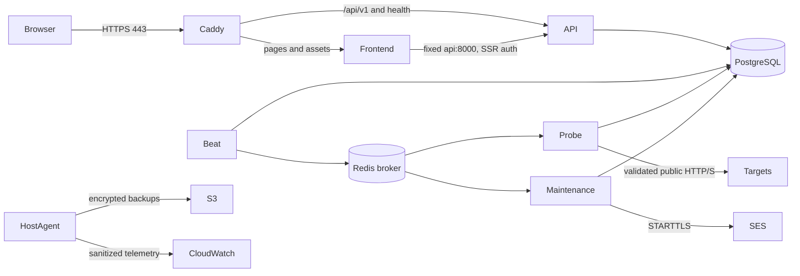

# Deployment proposal — milestone 20

**Unapproved design, 2026-10-02. No resources, image publication, DNS changes or deployment have been performed.** The [release audit](release-audit.md) is currently **NO-GO for deployment**. This package is a concrete basis for a later approval; it is not an instruction to deploy the development Compose files.

## Recommendation and availability

For an owner-operated portfolio launch, propose **one on-demand Linux m7i.large (2 vCPU, 8 GiB), us-east-1**, with PostgreSQL and Redis on the same host. Estimated baseline is **USD112.23/month**, including the assumptions below. A separately priced managed alternative is **USD424.36/month**. Both need staging measurements on the selected hardware. The [milestone 19 benchmark](performance.md) ran locally against a tiny controlled HTTP response and cannot establish cloud capacity or an SLA.

The single host is a failure domain for the UI, scheduler, database and broker. Host/AZ loss and maintenance cause downtime and delayed observations. Backups reduce data loss; they do not supply failover. Proposed recovery objectives are **RPO 24 hours, RTO 4 hours**, subject to a successful cloud restore drill. No availability promise is made. Choose the managed option if the owner cannot accept this risk and can fund its higher recurring cost.

## Exact single-host topology

| Resource | Proposed configuration |
| --- | --- |
| Region / AZ | us-east-1 / us-east-1a, subject to account AZ mapping and capacity check |
| VPC / subnet | 10.20.0.0/16; public 10.20.1.0/24; internet gateway; no NAT gateway |
| Host | m7i.large, Ubuntu 24.04 LTS x86_64; patched AMI ID and kernel recorded at approval; one Elastic IPv4 |
| Disks | 20 GiB root + 80 GiB data, gp3 baseline 3,000 IOPS / 125 MiB/s, encrypted with AWS-managed EBS key |
| Data | PostgreSQL 18 under `/var/lib/postgresql` in its container, durable host data disk; Redis AOF and Caddy certificate state on separate data subdirectories |
| Application | One frontend, one API, one prefork probe worker (concurrency 2), one maintenance worker, exactly one Beat; explicit one-shot Alembic migration |
| Image storage | Two private ECR repositories, immutable release tags and approved image digests; 10 GB combined budget, retain current + rollback images |
| Backup | Private S3 Standard bucket in same region, SSE-S3, block public access, TLS-only policy, versioning; 100 GB including old versions; 50 GB incremental encrypted EBS snapshots |
| Email | SES us-east-1 SMTP STARTTLS port 587, verified owner-selected domain; no Mailpit |
| Observability | CloudWatch sanitized logs, 30-day retention; metrics, alarms, dashboard and SNS operator email; external Route 53 HTTPS health check |



Only 80/443 are inbound to the host security group. No SSH, database, broker, application port or Docker API is public. Operators use MFA-backed SSM Session Manager. Caddy 2 terminates HTTPS and redirects HTTP; its exact patched image digest must be selected and scanned before implementation. The owner must supply a domain they control. Create its Route 53 A record pointing to the Elastic IP, TTL 300, only after authorization. Do not create a live-demo link before approved smoke tests. No AAAA record until IPv6 isolation is independently verified. ACME issuance/renewal and certificate state backup are required.

Preserve same-origin `/api/v1`. Route API traffic directly from Caddy to `api:8000`; other requests go to `frontend:3000`. Strip client-supplied forwarding headers. Reserve private ingress address `172.30.0.2` on a dedicated `172.30.0.0/24` Docker bridge, configure Uvicorn to trust **only that proxy**, and verify client-IP throttling through it. Current local Uvicorn disables proxy headers and Next's development proxy collapses client-IP rate limits; this must not be copied unchanged to production. Keep API inaccessible from the internet except through ingress. Limit request bodies to 64 KiB, bound headers/timeouts, and test security headers (HSTS after HTTPS validation, Referrer-Policy, nosniff and a compatible CSP). These ingress controls are proposed, not implemented or locally verified.

Set production environment and exact HTTPS application origin; production startup rejects fixture destinations. Use production-only credentials, no test database initialization, fixture containers, Mailpit or benchmark overlay. Keep app processes non-root, read-only, capability-free, with no Docker socket or host credential mount. Reserve host memory for PostgreSQL/OS; set per-service limits after staging load tests and measure DB connection totals across prefork processes. Initial quota stays 10 monitors/account, 100 enabled deployment-wide.

## Probe isolation and secrets

Application URL/DNS validation, numeric-address pinning, TLS verification and bounded transport remain mandatory. Security groups are allow lists and cannot express every private-address deny. Add host firewall rules before Docker accept rules: reject arbitrary probe HTTP/S to host, VPC/RFC1918, link-local, metadata and reserved networks, permitting only exact configured PostgreSQL/Redis/DNS control-plane paths. Filter both forwarded and host-input traffic. Keep IPv6 container egress disabled until equivalent rules pass tests. Allow public destination ports 80/443 only for probes; DNS only to the designated resolver. API/maintenance SMTP access is separate.

Require IMDSv2, response hop limit 1, and disable the IPv6 metadata endpoint. Explicitly block `169.254.169.254` and `fd00:ec2::254` from containers. These controls protect the host's IAM credentials even if a container is compromised; validate them from an actual worker before launch. See [AWS metadata settings](https://docs.aws.amazon.com/AWSEC2/latest/UserGuide/configuring-instance-metadata-options.html). The development Compose network is not evidence of this cloud isolation.

Four Secrets Manager bundles: runtime database login, migration database login, Redis ACL credential, SES SMTP credential. Do not embed secrets in images, commands, logs, evidence or checked-in environment files. The host bootstrap fetches only its permitted secret ARNs into root-controlled runtime configuration. Migration credentials are provided only during an operator migration. Restrict PostgreSQL runtime grants to required DML/sequences; runtime is neither superuser nor schema owner. Enable Redis authentication and least-required Celery ACL commands/key prefix; verify real task/recovery behavior before rollout. Single-host PG/Redis remain on private local bridges; the managed option requires verified TLS.

| Principal | Scope to prepare for approval |
| --- | --- |
| Human release operator | MFA role, bounded session; specific ECR push repositories, deployment resources, explicit migration secret; narrowly scoped PassRole; no permanent access keys |
| EC2 host role | SSM core channels; pull-only ECR (authorization token action needs `*`, layer/image reads limited to two repository ARNs); three runtime secret ARNs; CloudWatch log streams and PutMetricData limited to DevPulse namespace; backup PutObject and prefix-limited ListBucket |
| Backup restore operator | Separate read-version/GetObject authority on backup prefix; no routine application permission to retrieve/delete backups |
| Lifecycle administrator | Retention/lifecycle changes and object-version deletion; excluded from application and routine host roles |
| Application containers | No IAM role, no instance metadata, no AWS credentials; only per-service DB/broker/SMTP secrets required for their work |

SSE-S3 and AWS-managed EBS encryption avoid a customer-managed KMS key charge in this proposal. A customer-managed key or separate backup account changes IAM and costs and requires a revised proposal. SES requires region-specific production access, verified sending identity, DKIM/SPF/DMARC and a reviewed bounce/complaint process before public signup; these have not been provisioned. See [SES production access](https://docs.aws.amazon.com/ses/latest/dg/request-production-access.html).

## Managed alternative: ECS, RDS and ElastiCache

Use the same region/VPC with public subnets `10.20.1.0/24` and `10.20.2.0/24` in us-east-1a/b, private app/data subnets `10.20.11.0/24` and `10.20.12.0/24`. Internet-facing ALB across both public subnets; HTTPS regional ACM certificate; HTTP redirect; host/path rules preserve `/api/v1`. Route 53 Alias to ALB. Private tasks have no public IP; one zonal NAT gateway per AZ. S3 gateway endpoint avoids NAT for same-region backups. No paid interface endpoints are assumed.

| Fargate service (Linux x86) | Count | vCPU / memory per task |
| --- | --- | --- |
| Frontend | 2 across AZs | 0.5 / 1 GiB |
| API | 2 across AZs | 0.5 / 1 GiB |
| Probe worker | 1 | 1 / 2 GiB |
| Maintenance worker | 1 | 0.5 / 1 GiB |
| Beat | 1 | 0.25 / 0.5 GiB |
| Total | 7 | 3.75 vCPU / 7.5 GiB |

20 GiB included ephemeral disk/task; no paid excess ephemeral storage. Configure ECS Service Connect alias `api:8000` for the fixed SSR destination; sidecar resources must fit the stated task allocations or the quote must increase. Beat uses stop-before-start deployment (minimum healthy 0%, maximum 100%) and an operator singleton check. Frontend/API rolling overlap adds transient cost. Worker/Beat task replacement still causes gaps; this is not a zero-downtime design.

RDS PostgreSQL 18: **db.t4g.medium (2 vCPU, 4 GiB), Multi-AZ DB instance with standby**, 50 GiB gp3, encrypted, private subnet group, 7-day automated backups/PITR, 50 GB additional backup allowance. This is not the more expensive three-instance Multi-AZ DB cluster. ElastiCache **Redis OSS 7.1, two cache.t4g.small nodes**, one primary/replica, cluster mode disabled, automatic failover, TLS/auth, DB 0. Local Redis 7.4 tests do not prove managed 7.1 compatibility: verify the selected engine/version/class availability and Celery reconnect/ACL behavior in staging. RDS ARM hardware does not change x86 application task architecture.

Security groups: ALB → frontend/API ports only; frontend → API; application roles → RDS5432/Redis6379; probe public80/443; mail services → SES587. Configure API trusted proxy ranges strictly to dedicated ALB subnets with SG enforcement and test spoofed headers. Apply equivalent private/metadata destination rejection and task-role isolation; [ECS network security](https://docs.aws.amazon.com/AmazonECS/latest/developerguide/security-network.html) is a starting point, not proof that NAT or SGs prevent SSRF. Task execution role pulls images/secrets/logs; application task role has no AWS permissions. Migration task gets its own database secret.

## Cost model and sources

USD, 730 hours/month, on-demand, no commitments, credits or free-tier deductions. Service-included gp3 baseline I/O and Fargate 20 GiB/task are included product capacity, not a promotional free-tier assumption. The [machine-readable model](evidence/m20-cost-model.json) contains **every line's quantity, unit price, exact decimal subtotal and source**. [Saved catalog selections](evidence/m20-aws-catalog-prices.json) include SKUs, rate codes and effective dates fetched from public AWS catalogs on 2026-10-02. Prices and quantities must be revalidated immediately before approval.

| Shared monthly item | Assumption | USD |
| --- | --- | ---: |
| ECR | 10 GB × $0.10 | 1.00 |
| S3 | 100 GB × $0.023; 1,000 PUT/LIST + 1,000 GET | 2.3054 |
| CloudWatch | 5 GB ingestion × $0.50; 5 GB storage × $0.03; 10 metrics × $0.30; 15 alarm metrics × $0.10; one $3 dashboard; 10 GB query × $0.005; 44,000 API requests × $0.00001 | 10.64 |
| DNS / external HTTPS check | $0.50 zone; 100,000 standard queries × $0.50/million; $1.50 HTTPS check | 2.05 |
| SES | 2,000 outbound emails × $0.10/1,000; no attachments | 0.20 |
| Secrets Manager | 4 × $0.40; 10,000 API requests × $0.05/10,000 | 1.65 |
| SNS | 500 email alerts × $2/100,000 + 500 publishes × $0.50/million | 0.01025 |
| Internet data out | 50 GB × $0.09, free allocation deliberately ignored | 4.50 |
| Domain reserve | $20.04/year placeholder, actual domain/registrar unselected | 1.67 |
| **Shared subtotal** | Rounded only after summing | **24.03** |

Sources: [ECR](https://aws.amazon.com/ecr/pricing/), [S3](https://aws.amazon.com/s3/pricing/), [CloudWatch](https://aws.amazon.com/cloudwatch/pricing/), [dashboard rate](https://docs.aws.amazon.com/solutions/latest/cost-optimizer-for-workspaces/insights-dashboard.html), [Route 53](https://aws.amazon.com/route53/pricing/), [SES](https://aws.amazon.com/ses/pricing/), [Secrets Manager](https://aws.amazon.com/secrets-manager/pricing/), [SNS](https://aws.amazon.com/sns/pricing/), [VPC/data-transfer examples](https://aws.amazon.com/vpc/pricing/). S3 request/storage and compute rates are also retained in the catalog evidence.

| Single-host additions | Assumption | USD/month |
| --- | --- | ---: |
| m7i.large | 730 × $0.1008 | 73.584 |
| EBS gp3 | 100 GB × $0.08 | 8.00 |
| Public IPv4 | 730 × $0.005 | 3.65 |
| EBS standard snapshots | 50 incremental GB × $0.05 | 2.50 |
| Restore drill | 4 host-hours, 100 GB disk prorated for 4 hours, 4 IPv4-hours | 0.4670 |
| **Including shared subtotal** | Exact model rounding | **112.23** |

Sources: [EC2 regional catalog](https://pricing.us-east-1.amazonaws.com/offers/v1.0/aws/AmazonEC2/current/us-east-1/index.csv), [EBS](https://aws.amazon.com/ebs/pricing/), [IPv4](https://aws.amazon.com/vpc/pricing/).

| Managed additions | Assumption | USD/month |
| --- | --- | ---: |
| Fargate CPU / RAM | 2,737.5 vCPU-hours × $0.04048 + 5,475 GB-hours × $0.004445 | 135.150375 |
| ALB | 730 × $0.0225 + 730 LCU-hours × $0.008 | 22.265 |
| Public IPv4 | 2 ALB + 2 NAT addresses × 730 × $0.005 | 14.60 |
| NAT | 2 × 730 × $0.045 + 100 GB bidirectional × $0.045 | 70.20 |
| RDS Multi-AZ | 730 × $0.129 + 50 GB × $0.230 | 105.67 |
| Extra RDS backups | 50 GB beyond included allocation × $0.095 | 4.75 |
| Redis primary/replica | 2 × 730 × $0.032 | 46.72 |
| Restore drill | 4 RDS Multi-AZ hours + prorated 50 GB disk | 0.5790 |
| Cross-AZ transfer allowance | 20 charged-side GB × $0.01 | 0.20 |
| Cloud Map registration allowance | 2 API resources × $0.10 (conservative allowance for discovery) | 0.20 |
| **Including shared subtotal** | Exact model rounding | **424.36** |

Sources: [Fargate](https://aws.amazon.com/fargate/pricing/), [ALB](https://aws.amazon.com/elasticloadbalancing/pricing/), [NAT/IPv4](https://aws.amazon.com/vpc/pricing/), [RDS PostgreSQL](https://aws.amazon.com/rds/postgresql/pricing/), [ElastiCache](https://aws.amazon.com/elasticache/pricing/), [Cloud Map](https://aws.amazon.com/cloud-map/pricing/). Use the saved normal Redis price row, not Valkey or Redis extended-support rows. Chargeable cross-AZ bytes count each billable side; same-service included replication is not charged again.

Recalculate locally, without cloud credentials:

```bash
.venv/bin/python - <<'PY'
import json
from decimal import Decimal
from pathlib import Path
m = json.loads(Path('docs/evidence/m20-cost-model.json').read_text())
for option in ('single_ec2', 'managed_ecs'):
    total = sum(Decimal(r['quantity']) * Decimal(r['usd_per_unit'])
                for r in m['common'] + m[option])
    print(option, total.quantize(Decimal('.01')), 'USD/month')
PY
```

These estimates are not spending caps. Tax, exchange rate, paid support, operator labor, premium domain cost and sustained RDS T-class surplus CPU charges are excluded and must be priced if applicable. Basic support only; no WAF, CDN, paid KMS key, managed security suite, interface endpoints, enhanced container insights, provisioned I/O or second standing environment is enabled in the design. Adding any changes the quote. Deployment overlap, failed restore attempts and retained snapshots also cost money.

| Sensitivity / budget | Consequence |
| --- | --- |
| Extra 100 GB internet egress | +$9 at the modeled tier |
| Extra 100 GB through NAT | +$4.50, including downloaded probe responses; separate from egress |
| 100 monitors every minute | ~4.38 million scheduled runs/730-hour month, before retries; 1 MiB response each means ~4.6 TB decimal through NAT (~$207 processing), far above baseline |
| Extra 10 GB logs | +$5 ingestion plus retention/query charges; never log a response per probe |
| Extra 100 GB gp3 / S3 backups | +$8 / +$2.30 monthly respectively |
| More ALB load or addresses | Extra average LCU costs $5.84/month; extra IPv4 $3.65/month |
| Managed staging kept for a month | Approximately another full managed baseline, not included |
| Proposed owner budgets | Single host $150/month (alerts $50/$100/$150); managed $500/month (alerts $250/$400/$500); alerts do not stop billing |

## Approval record (blank; no authorization inferred)

Before any paid action, record the owner's selected option, AWS account/region, domain/DNS authority, exact patched image and AMI digests, monthly budget and overage policy, operator/alarm recipient, retention/data-loss acceptance, reviewed IAM policy ARNs and completed release gates. Record explicit authorization separately for creating resources, publishing images and changing public DNS. An approved design still requires a staged deployment and smoke-test result before public launch. See the [runbook](release-runbook.md) for execution gates, rollback and removal.
