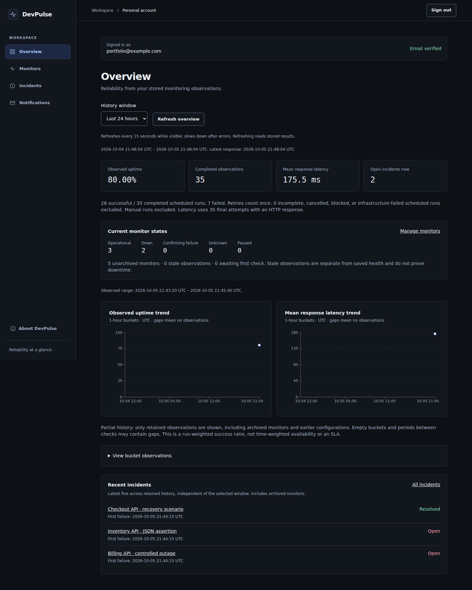
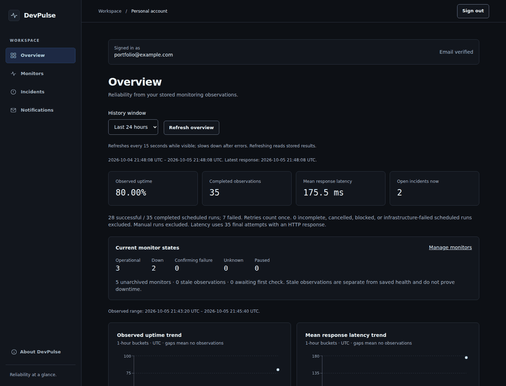
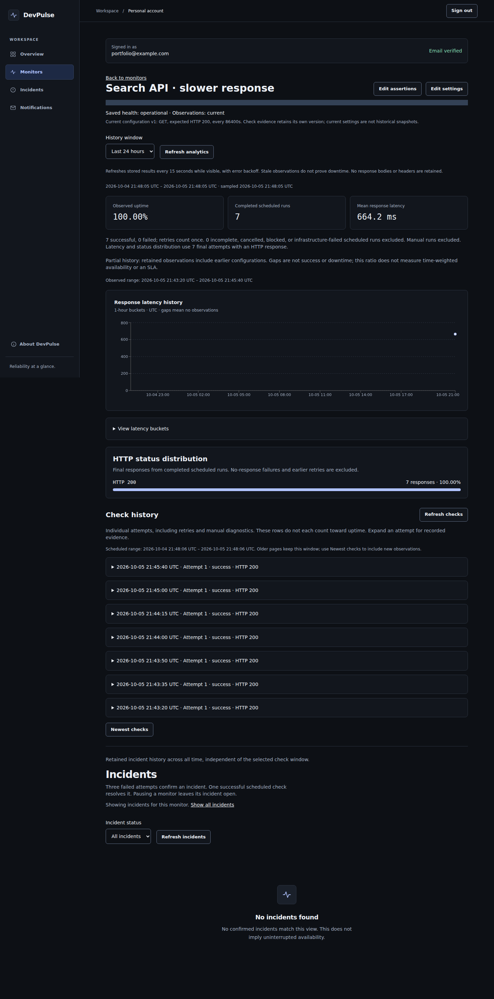
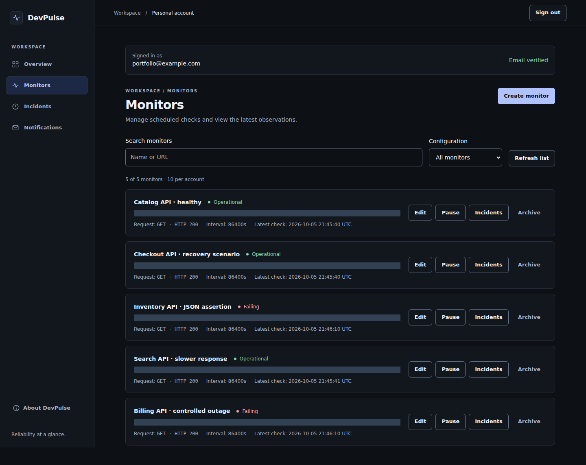
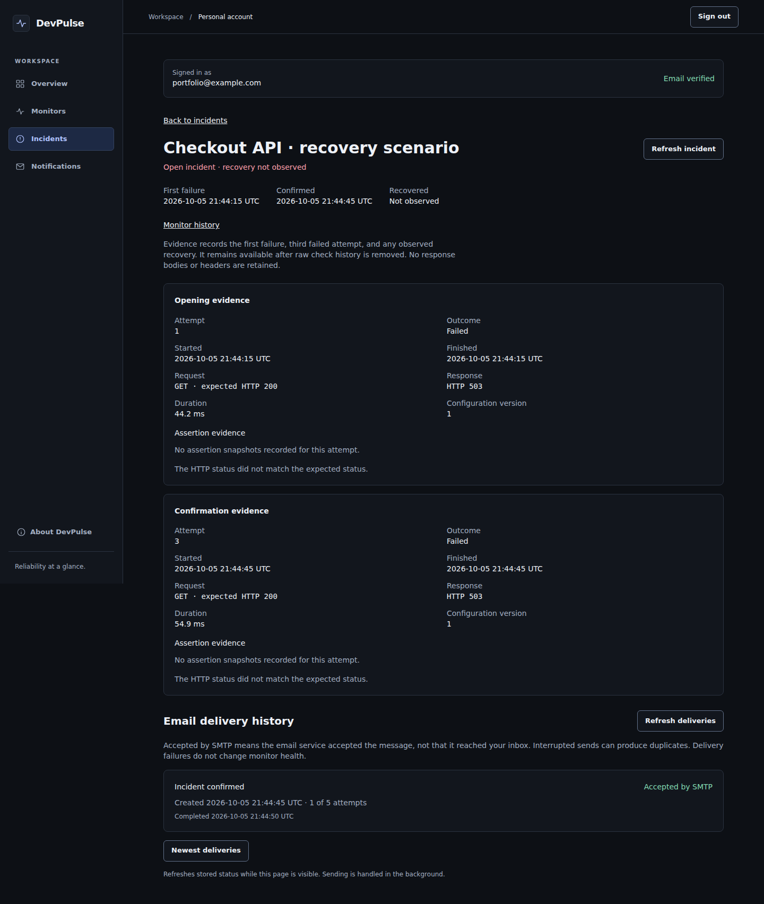
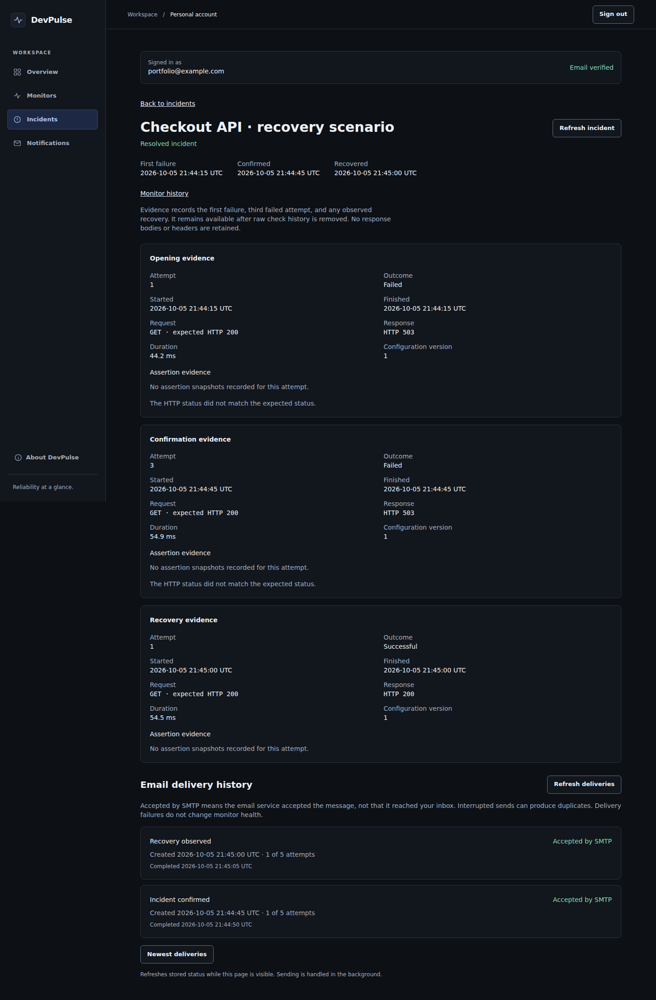
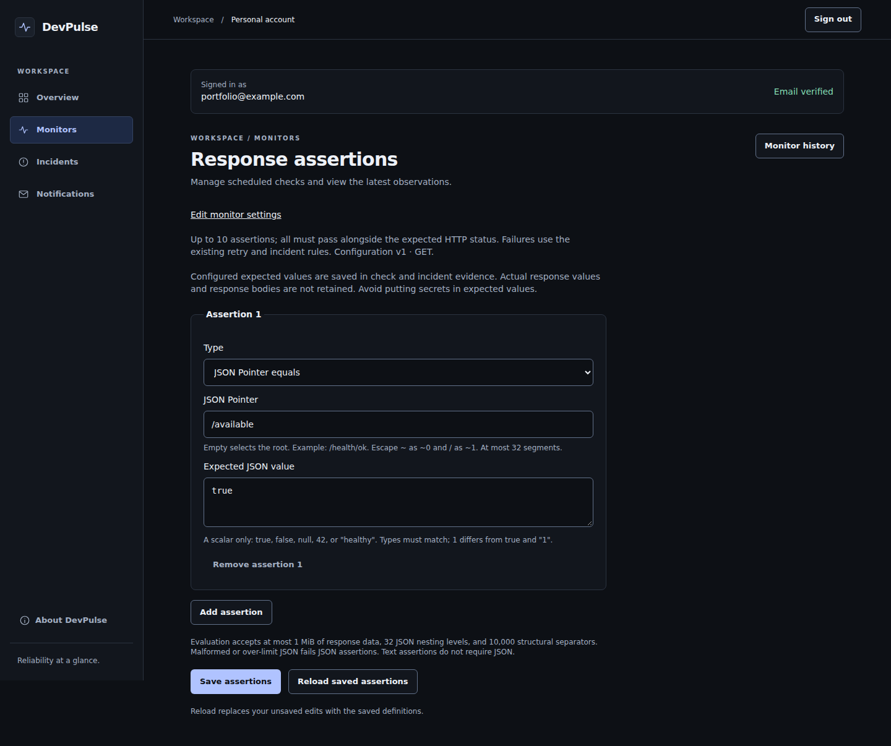

# Real Docker showcase gallery

Captured October 5, 2026 from the complete local Docker stack: Next.js, FastAPI, PostgreSQL, Redis, Celery prefork workers and Beat. Five controlled demo endpoints produced **35 scheduled runs and 49 actual HTTP attempts**. Three incidents were confirmed, checkout recovered, and four incident/recovery emails were accepted by Mailpit. These are controlled observations, not production users or traffic.

[Reproduce the scenario](showcase.md) · [Run and screenshot hashes](assets/showcase-evidence.json) · [Animation provenance](assets/animation-evidence.json).

## Overview

The 80% ratio reflects the deliberately induced failures in this short scenario. It is not an availability claim. Historical latency occupies one hourly bucket; unobserved hours remain empty.

The four-frame GIF is approximately 288 KiB. It uses real browser frames, resized and color-quantized only. Navigation order is dashboard → monitor history → earlier open incident → later recovery; it is not a continuous recording.

## Monitor history and current states

## Incident confirmation and recovery

| Confirmed incident | Observed recovery |
| --- | --- |
|  |  |

## Assertions

[View the full assertion-failure capture](assets/assertion-result.png): the endpoint returned HTTP 200, but the stored JSON assertion failed. Expandable evidence records the expected value and failed result without retaining response bodies.

## Mobile

[View the real mobile dashboard](assets/dashboard-mobile.png), captured at 390px width.

## Capture scope

All observations came through Beat → Redis → maintenance dispatcher → Redis → prefork probes → PostgreSQL. The helper seeds only monitor/assertion configuration and advances next-due times. It never inserts check/run/incident history, alters recorded timestamps or accelerates retry deadlines. See the [scenario and source](showcase.md).

Captures use a synthetic `portfolio@example.com` account. Playwright masks only loopback target URLs with a visible slate rectangle; statistics and evidence remain unchanged. No credentials, tokens, personal email, private targets, response bodies or filesystem paths appear. Screenshots are actual browser output, not designed mockups. The optional animation changes only image size and palette. Desktop captures use 1440px width; full-page images intentionally retain the application's evidence and caveats.

Earlier native browser screenshots under `screenshots/portfolio/` and `screenshots/m20/` remain dated historical test evidence. Their manifests are [October 4](evidence/portfolio-screenshots-2026-10-04.json) and [October 2](evidence/m20-screenshots.json). Unlike the current Docker showcase, native fixture setup accelerated retry clocks; those earlier captures are not presented as this worker-driven run.
