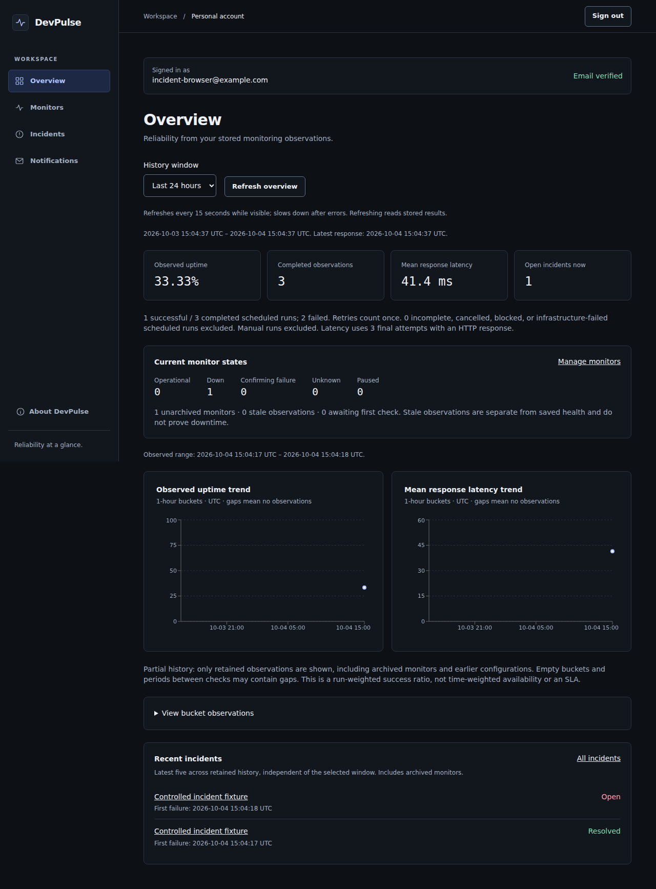

# Product screenshots

These are actual Chromium captures from the final local release pass on **2026-10-04**. The workspace uses disposable example.com accounts and real HTTP requests to controlled loopback fixtures. Failures are intentionally induced; test retry clocks are accelerated during browser fixture setup. These are product demonstrations, not production history, customer data or a claim of availability.

The [capture manifest](evidence/portfolio-screenshots-2026-10-04.json) records dimensions and SHA-256 hashes. Captures contain no passwords, verification codes, cookies, private production endpoints or response bodies. No bitmap editing was used. Desktop width is 1280px; mobile width is 360px. Pages are captured in full, including the intentionally long paginated monitor history.

| Surface | Desktop | Mobile |
| --- | --- | --- |
| Dashboard and analytics | [Overview](screenshots/portfolio/dashboard-desktop.png) | [Overview](screenshots/portfolio/dashboard-mobile.png) |
| Monitor detail and check history | [Monitor history](screenshots/portfolio/monitor-history-desktop.png) | [Monitor history](screenshots/portfolio/monitor-history-mobile.png) |
| Resolved incident and retained evidence | [Incident](screenshots/portfolio/incident-desktop.png) | [Incident](screenshots/portfolio/incident-mobile.png) |
| Notification preferences and SMTP history | [Notifications](screenshots/portfolio/notifications-desktop.png) | [Notifications](screenshots/portfolio/notifications-mobile.png) |
| Response assertion editor | [Assertions](screenshots/portfolio/assertions-desktop.png) | [Assertions](screenshots/portfolio/assertions-mobile.png) |
| Landing page | [Landing](screenshots/portfolio/landing-desktop.png) | [Landing](screenshots/portfolio/landing-mobile.png) |
| Restricted public demo | [Demo](screenshots/portfolio/demo-desktop.png) | [Demo](screenshots/portfolio/demo-mobile.png) |

The dashboard/demo show denominators, observed ranges, unknown gaps and the run-weighted meaning of uptime. The monitor-history suite adds real manual requests to exercise pagination; those requests are excluded from scheduled uptime. The incident screenshot proves retained evidence still renders after raw history pruning. Notification captures show local SMTP acceptance, not inbox delivery. The landing page embeds its explicitly labeled earlier local capture.

Blank-login, registration validation, monitor editing and archive-dialog captures were also reviewed locally. Keyboard/focus, contrast and no-horizontal-overflow checks passed within the [documented browser coverage](portfolio-release.md). This is not a full screen-reader or cross-browser accessibility certification.

The [2026-10-02 public-only capture manifest](evidence/m20-screenshots.json) and files under `screenshots/m20/` remain historical evidence.
