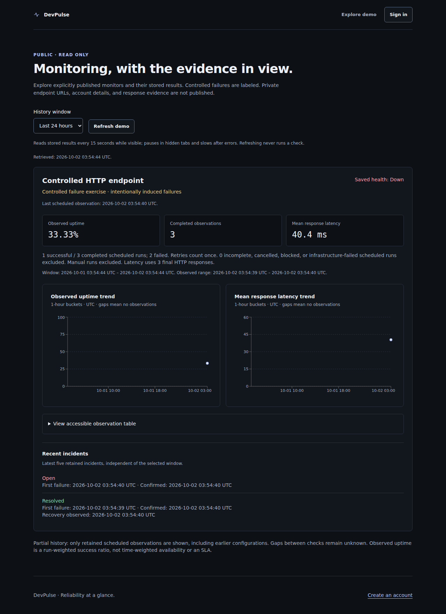

# Release screenshots

Captured by the milestone 20 local Chromium suite on 2026-10-02 UTC. These are actual browser captures, not generated mockups. The public demo used an isolated PostgreSQL schema and real controlled HTTP probes, including intentionally induced failures. It contains three completed scheduled observations, not production history. The landing page embeds its labeled earlier local demo capture; it does not advertise current service availability.

The [manifest](evidence/m20-screenshots.json) records dimensions, sizes and SHA-256 hashes. Screenshots include only the public surface: no accounts, tokens, private endpoint URLs or response evidence. Desktop width is 1280px; mobile width is 360px. Long pages are captured in full.

| Page | Desktop | Mobile |
| --- | --- | --- |
| Landing | [1280 × 2973](screenshots/m20/landing-1280.png) | [360 × 2766](screenshots/m20/landing-360.png) |
| Restricted demo | [1280 × 1758](screenshots/m20/demo-1280.png) | [360 × 2944](screenshots/m20/demo-360.png) |

The layout review found readable labels and no horizontal overflow at the tested widths. The demo states its denominator, observed range, unknown gaps and run-weighted meaning; status is conveyed with text as well as color. Functional browser tests cover the signup CTA, read-only demo navigation and accessible validation feedback. See the [audit](release-audit.md) for the limits of accessibility/browser coverage.
